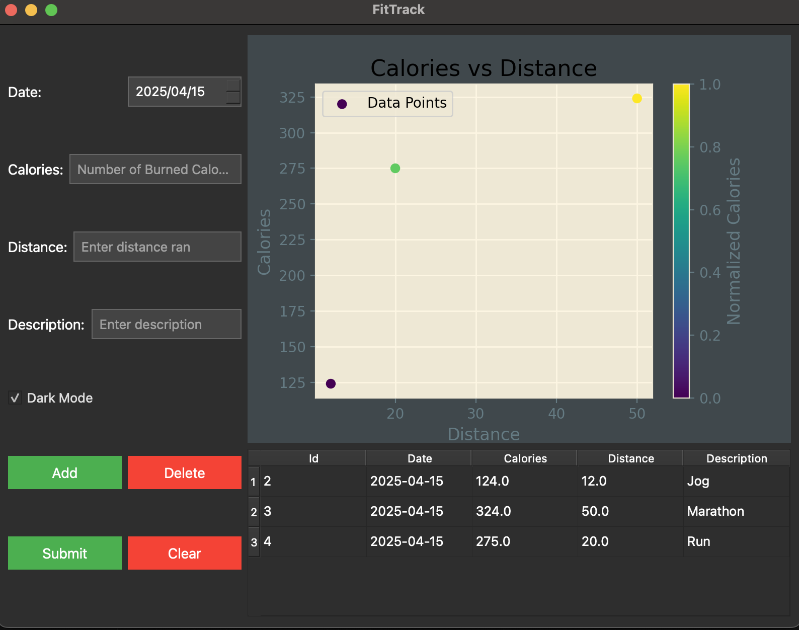
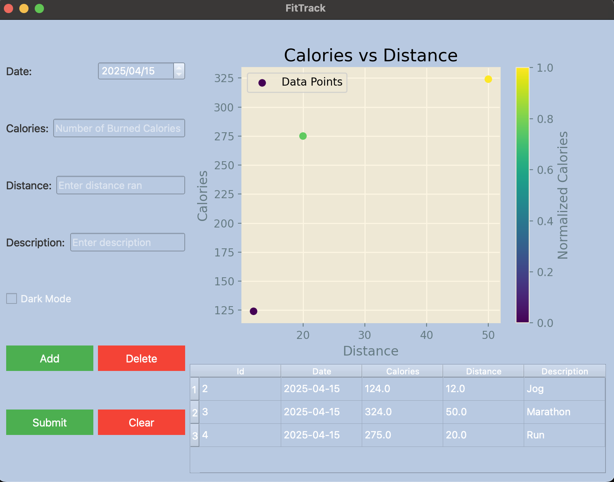

# FitTrack

**FitTrack** is a PyQt5-based fitness tracking desktop application that helps you log your daily workouts, including burned calories, distance run, and a description of the activity. It stores data locally using SQLite and visualizes trends using `matplotlib`.

## Features

- 📅 Log workouts with date, calories, distance, and description
- 📊 Visualize calorie vs. distance with color-coded data points
- 🌗 Toggle between light and dark mode
- 🧹 Clear form input with a reset button
- ➕ Add, ➖ delete, and submit data to your local database
- 📋 View all logged workouts in a table
- 🗃️ Data stored locally in an SQLite database

## Technologies Used

- Python 3
- PyQt5
- SQLite
- matplotlib

## Setup Instructions

### 1. Clone the Repository

```bash
    git clone https://github.com/NomsaNG/Master-tetris.git
    cd Master-tetris
```

### 2. Create a Virtual Environment
```bash
    python -m venv .venv
    source .venv/bin/activate  # macOS/Linux
    .venv\Scripts\activate     # Windows
```

### 3. Install Dependencies
```bash
    pip install -r requirements.txt
```

### 4.Run App
```bash
    python fittrack.py
```

## 📸 Preview

 
 